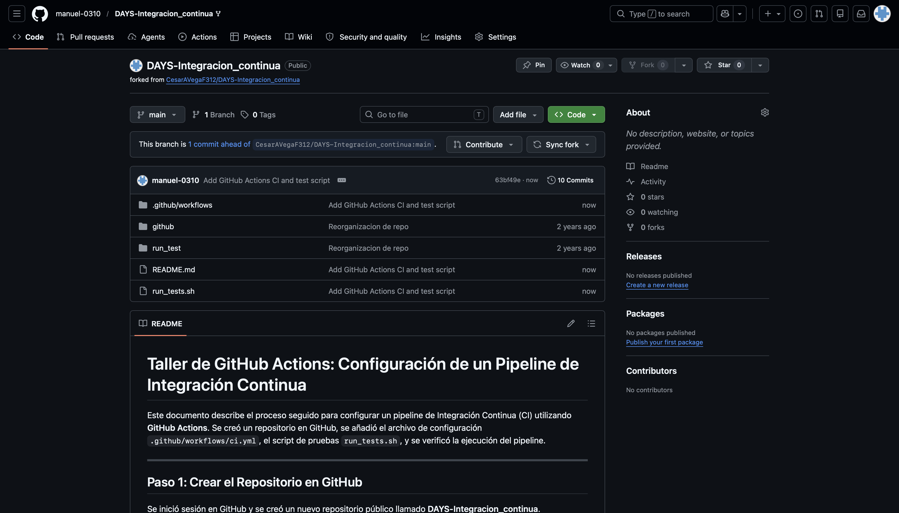
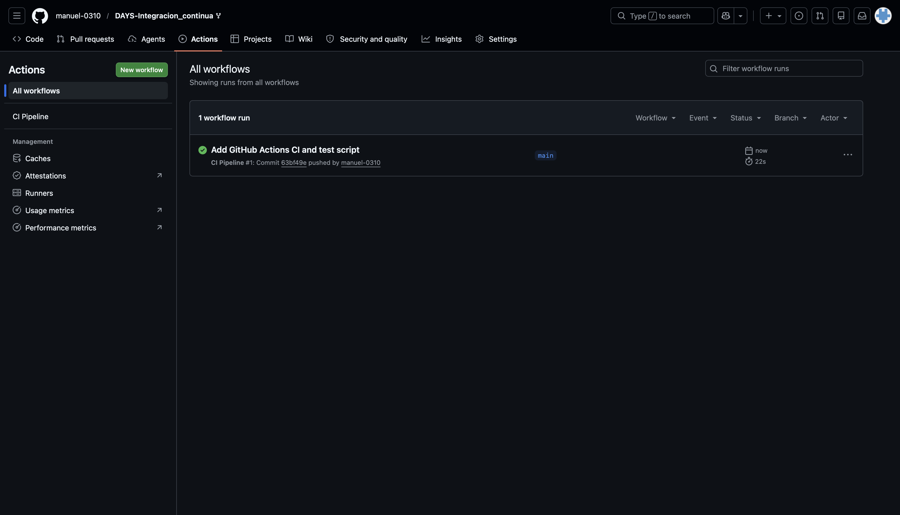
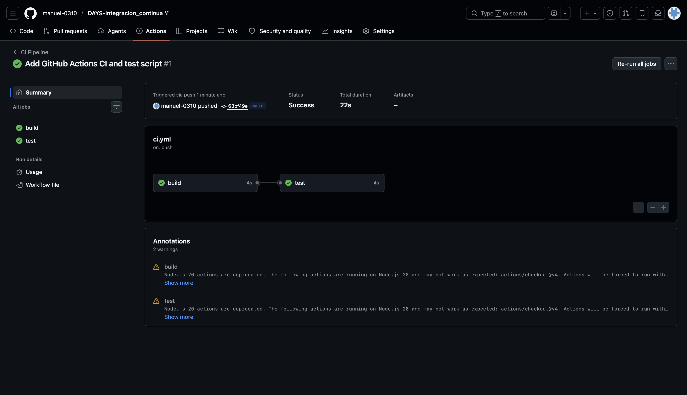
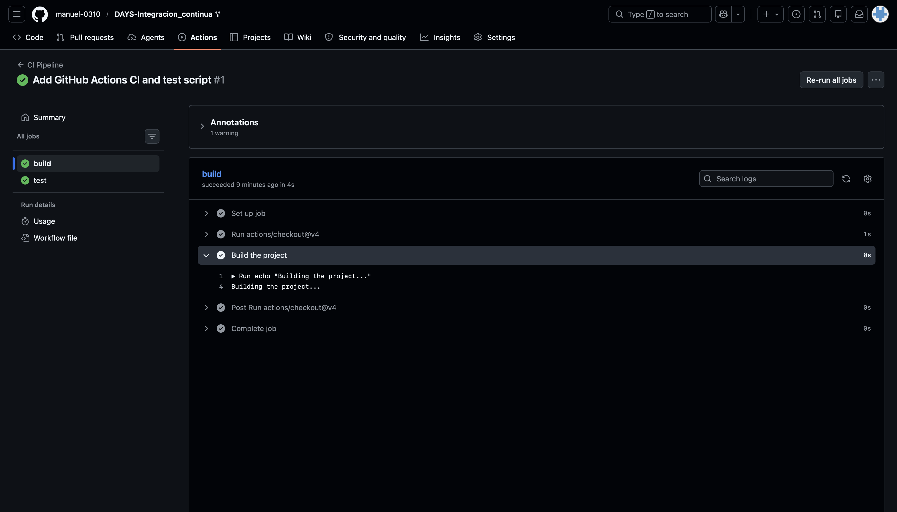
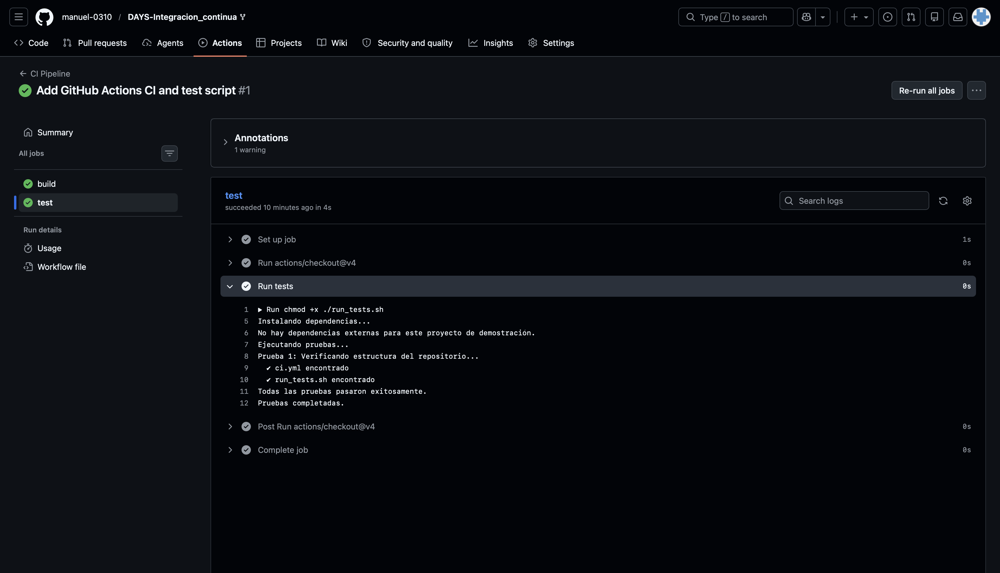

# Taller de GitHub Actions: Configuración de un Pipeline de Integración Continua

**Autores:** Manuel Castillo · Daniel Riveros

Este documento describe el proceso seguido para configurar un pipeline de Integración Continua (CI) utilizando **GitHub Actions**. Se creó un repositorio en GitHub, se añadió el archivo de configuración `.github/workflows/ci.yml`, el script de pruebas `run_tests.sh`, y se verificó la ejecución del pipeline.

---

## Paso 1: Crear el Repositorio en GitHub

Se inició sesión en GitHub y se creó un nuevo repositorio público llamado **DAYS-Integracion_continua**.



---

## Paso 2: Agregar el Archivo de Configuración de GitHub Actions

### 2.1 Estructura de archivos creada

Dentro del repositorio se creó la siguiente estructura:

```
DAYS-Integracion_continua/
├── .github/
│   └── workflows/
│       └── ci.yml
├── run_tests.sh
├── images/
└── README.md
```

### 2.2 Archivo `.github/workflows/ci.yml`

Se creó el archivo de configuración del pipeline con dos jobs: `build` y `test`.

```yaml
name: CI Pipeline

on: [push, pull_request]

jobs:
  build:
    runs-on: ubuntu-latest

    steps:
    - uses: actions/checkout@v4

    - name: Build the project
      run: echo "Building the project..."

  test:
    runs-on: ubuntu-latest
    needs: build

    steps:
    - uses: actions/checkout@v4

    - name: Run tests
      run: |
        chmod +x ./run_tests.sh
        ./run_tests.sh
```

- El pipeline se activa con cada `push` o `pull_request`.
- El job `build` se ejecuta primero en una máquina virtual con Ubuntu.
- El job `test` depende de `build` (usando `needs: build`) y ejecuta el script de pruebas.

### 2.3 Archivo `run_tests.sh`

Se creó el script de pruebas:

```sh
#!/bin/sh

# Salir inmediatamente si un comando falla
set -e

echo "Instalando dependencias..."
echo "No hay dependencias externas para este proyecto de demostración."

echo "Ejecutando pruebas..."
echo "Prueba 1: Verificando estructura del repositorio..."
test -f .github/workflows/ci.yml && echo "  ✔ ci.yml encontrado"
test -f run_tests.sh && echo "  ✔ run_tests.sh encontrado"

echo "Todas las pruebas pasaron exitosamente."
echo "Pruebas completadas."
```

Se le otorgaron permisos de ejecución con:

```sh
chmod +x run_tests.sh
```



---

## Paso 3: Commit y Push

Se realizó el commit de todos los archivos al repositorio con los siguientes comandos:

```sh
git add .github/workflows/ci.yml
git add run_tests.sh
git commit -m "Add GitHub Actions CI configuration"
git push origin main
```

---

## Paso 4: Verificar la Ejecución del Pipeline

### 4.1 Pipeline en ejecución

Al hacer push de los archivos, GitHub Actions detectó el archivo `ci.yml` y disparó el pipeline automáticamente. Desde la pestaña **Actions** del repositorio se puede ver el flujo de trabajo ejecutándose.



### 4.2 Detalle del Job `build`

El job `build` se ejecutó correctamente imprimiendo el mensaje de construcción.



### 4.3 Detalle del Job `test`

Una vez completado el `build`, el job `test` ejecutó el script `run_tests.sh` verificando la estructura del repositorio. Ambos jobs finalizaron sin errores, mostrando el checkmark verde de éxito.



---

## Resumen

En este taller se realizaron los siguientes pasos:

| Paso | Descripción | Estado |
|------|-------------|--------|
| 1 | Creación del repositorio en GitHub | ✅ Completado |
| 2 | Configuración del archivo `.github/workflows/ci.yml` | ✅ Completado |
| 3 | Creación del script `run_tests.sh` | ✅ Completado |
| 4 | Commit y Push al repositorio | ✅ Completado |
| 5 | Verificación del pipeline en GitHub Actions | ✅ Completado |

La configuración de un pipeline de CI con GitHub Actions permite automatizar la integración y verificación del código en cada push o pull request, mejorando la calidad y la eficiencia del desarrollo de software.
